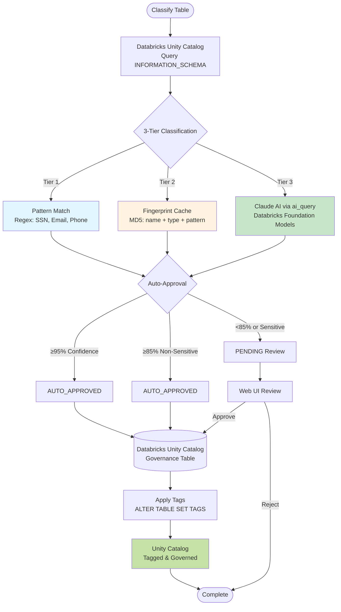

# Data Classification Platform on Databricks

AI-powered data classification using Databricks Unity Catalog and Claude 3.7 Sonnet.

## What It Does

Automatically classifies database columns against your organization's data taxonomy. Uses AI to identify sensitive data like SSN, email addresses, and personal information, then applies Unity Catalog tags for governance.

## Architecture & Backend Flow



### Flow Explanation

**Classification Pipeline (3-Tier System):**
1. **Tier 1 - Pattern Rules:** Fast regex matching for common PII (SSN, Email, Phone, Credit Card)
2. **Tier 2 - Cache Lookup:** Reuse high-confidence classifications from similar columns (fingerprint-based)
3. **Tier 3 - Claude AI:** Use Claude 3.7 Sonnet via `ai_query()` for intelligent classification

**Auto-Approval Logic:**
- **Tier 1 (≥95% + Pattern):** Immediate auto-approval
- **Tier 2 (≥85% + Non-Sensitive):** Conditional auto-approval
- **Tier 3 (<85% or Sensitive):** Manual review required

**Tag Application:**
- Executes `ALTER TABLE ... SET TAGS` for each approved classification
- Updates tracking table to `APPLIED` status
- Tags become visible in Unity Catalog

## Key Features

- AI classification with Claude 3.7 Sonnet
- Web UI for managing your custom taxonomy
- Support for any number of data elements
- Automatic Unity Catalog tag application
- Review and approve classifications before tagging

## Setup and Installation

### Prerequisites
- Databricks workspace with Unity Catalog enabled
- SQL Warehouse (get the warehouse ID)
- Databricks CLI installed and configured
- Python 3.9+
- Your organization's data taxonomy in Excel/CSV format

### Step 1: Set Environment Variables

Configure your environment with these required variables:

```bash
export ORG_NAME="your_org"                    # e.g., "acme" (default: "carmax")
export WAREHOUSE_ID="your_warehouse_id"       # Required
export DATABRICKS_CONFIG_PROFILE="your_profile"  # Optional
```

These variables configure schema names (`main.{ORG_NAME}_taxonomy`) without any code changes.

### Step 2: Create Database Schemas and Tables

Run the automated setup script:

```bash
python3 scripts/setup_schemas.py
```

This creates two schemas:
- `main.{ORG_NAME}_taxonomy` - Data element definitions
- `main.{ORG_NAME}_governance` - Classification tracking

### Step 3: Import Your Taxonomy

Prepare your taxonomy Excel/CSV files with these columns:

**Data Elements File:**
- Data Element Name (e.g., "Social Security Number")
- Data Category (e.g., "Personal Identifiers")
- Sensitive_Flag ("Yes" or "No")
- Description (optional)

**Subject Types File:**
- Data Subject Type Id (e.g., "CUSTOMER")
- Data Subject Type Name (e.g., "Customer")
- Description

**Option A** - Using default file paths (place files in `data/` folder):
```bash
python3 scripts/import_taxonomy.py
```

**Option B** - Using custom file paths:
```bash
python3 scripts/import_taxonomy.py \
  --elements-file /path/to/your/elements.xlsx \
  --subjects-file /path/to/your/subjects.xlsx
```

### Step 4: Configure and Deploy the App

Update `databricks.yml` with your settings:
- App name
- Warehouse ID
- Service principal name (optional)

Deploy the app:

```bash
databricks bundle deploy -t dev
```

### Step 5: Grant Permissions

Grant the app's service principal access to Unity Catalog:

```sql
GRANT ALL PRIVILEGES ON SCHEMA main.<your_org>_taxonomy TO `your-service-principal`;
GRANT ALL PRIVILEGES ON SCHEMA main.<your_org>_governance TO `your-service-principal`;
GRANT USE CATALOG ON CATALOG main TO `your-service-principal`;
```

### Step 6: Access the App

After deployment, Databricks CLI will output the app URL. Open it in your browser to start classifying data!

## How To Use

### 1. Dashboard
View statistics about your taxonomy and classifications.

### 2. Taxonomy Tab
- View all your data elements
- Add, edit, or delete elements
- Search and filter by category

### 3. Classify Tab
1. Select a catalog and schema
2. Click "Classify Columns"
3. Wait for AI to analyze and classify

### 4. Review Tab
- Review AI classifications
- Approve or reject suggestions
- Edit classifications if needed

## Viewing Applied Tags

After classifying and approving data elements, you can view the applied tags through:

### Catalog Explorer (UI)
1. Click the **Catalog** icon in the sidebar
2. Navigate to your catalog > schema > table
3. On the table's page, view column tags in the **Tags** section

### Using SQL
Query the `INFORMATION_SCHEMA.COLUMN_TAGS` view to see all column tags:

```sql
SELECT *
FROM main.information_schema.column_tags
WHERE schema_name = '<your_org>_taxonomy';  -- e.g., 'carmax_taxonomy'
```

For more details on Unity Catalog tags, see: https://docs.databricks.com/en/data-governance/unity-catalog/tags.html


## Project Structure

```
ai_catalog/
├── app/                    # Flask backend
│   ├── main.py            # REST API
│   ├── taxonomy_manager.py
│   └── templates/app.html # Web UI
├── static/app.js          # Frontend JavaScript
├── sql/                   # Database setup scripts
├── scripts/               # Import scripts
├── data/                  # Sample Excel files
└── databricks.yml         # Deployment config
```

## Customization

### Ongoing Taxonomy Management
After initial setup, use the Taxonomy Tab in the web UI to:
- Add new data elements
- Edit existing elements
- Delete elements
- Search and filter by category

No need to re-import Excel files for ongoing updates.

### Branding
Update these files for your organization:
- `app/templates/app.html` - Header and title
- `databricks.yml` - App name and description

## Troubleshooting

**No data elements showing in Taxonomy tab:**
- Run the taxonomy import script: `python3 scripts/import_taxonomy.py`
- Ensure your Excel files have the required columns (see Step 3 above)
- Verify the `ORG_NAME` environment variable matches your deployed schema name
- Check that data was loaded into the `{ORG_NAME}_taxonomy.data_elements` table

**Schema not found errors:**
- Run `python3 scripts/setup_schemas.py` to create required schemas
- Ensure `WAREHOUSE_ID` and `ORG_NAME` environment variables are set
- Verify you have CREATE SCHEMA permissions in Unity Catalog
- Check that schemas `main.{ORG_NAME}_taxonomy` and `main.{ORG_NAME}_governance` exist

**Permission errors:**
- Grant ALL PRIVILEGES on both `{ORG_NAME}_taxonomy` and `{ORG_NAME}_governance` schemas to the app's service principal
- Ensure service principal has warehouse access and USE CATALOG permission on the main catalog

**App not starting or crashes:**
- Verify `WAREHOUSE_ID` is correct in `databricks.yml`
- Verify `ORG_NAME` is set correctly (defaults to "carmax" if not set)
- Check that schemas exist before starting the app
- Review app logs for missing environment variables

**Classification not working:**
- Ensure you've imported taxonomy data via `scripts/import_taxonomy.py`
- Verify the model endpoint `databricks-claude-3-7-sonnet` is available in your workspace
- Check that the selected catalog/schema exists and you have permissions

**Tags not showing in Unity Catalog:**
- Tag creation happens automatically when you import taxonomy via the import script
- Check that you have tag creation permissions in Unity Catalog
- Review app logs for tag creation errors (may show rate limiting)

**Changes not showing in browser:**
- Do a hard refresh (Cmd+Shift+R or Ctrl+Shift+R)
